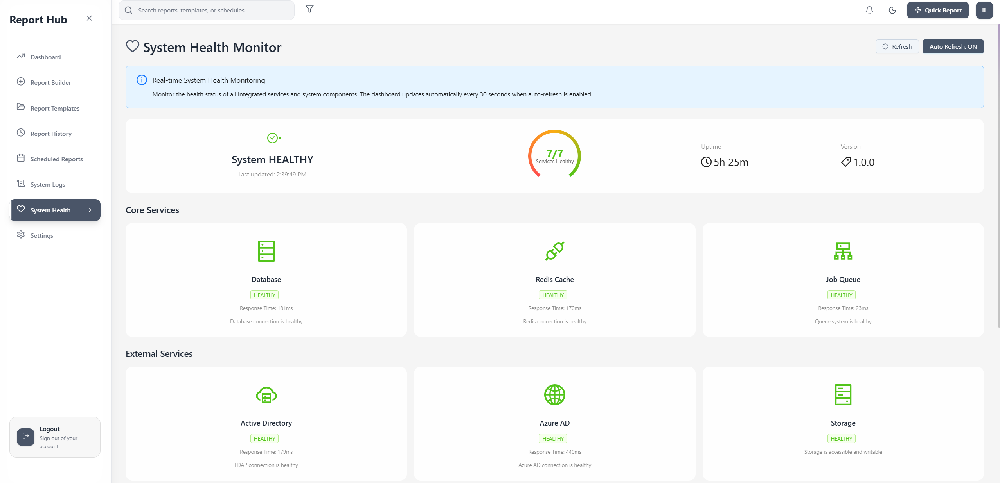

# SimpleAdminReporter


A comprehensive, containerized enterprise reporting application for Active Directory, Azure AD, and Office 365 environments. Built with modern web technologies and designed for Docker/WSL deployment.

## 📋 Table of Contents

- [Overview](#overview)
- [Screenshots](#screenshots)
- [Executive Presentation](#executive-presentation)
- [Key Features](#key-features)
- [Technology Stack](#technology-stack)
- [Architecture](#architecture)
- [Quick Start](#quick-start)
- [Authentication](#authentication)
- [API Overview](#api-overview)
- [Development Setup](#development-setup)
- [Testing](#testing)
- [Deployment](#deployment)
- [Documentation](#documentation)
- [Contributing](#contributing)
- [License](#license)

## 🎯 Overview

SimpleAdminReporter is a modern web application that provides comprehensive reporting capabilities for enterprise IT environments. It connects to multiple data sources including Active Directory (LDAP), Azure AD, and Office 365 to generate both pre-built and custom reports for system administrators and IT professionals.

**Key Benefits:**
- **Unified Reporting**: Single interface for AD, Azure AD, and O365 data
- **Real-time Insights**: Live dashboards with WebSocket updates
- **Custom Report Builder**: Drag-and-drop interface for creating custom reports
- **Enterprise Security**: Multi-factor authentication and audit logging
- **Background Processing**: Queue-based report generation with Redis
- **Docker Native**: Fully containerized for easy deployment and scaling

## 📸 Screenshots

### Main Dashboard

*Comprehensive reporting dashboard with analytics and recent activity*

### Report Templates Hub

*Browse and execute 59 pre-built report templates across AD, Azure AD, and Office 365*

### Visual Query Builder

*Drag-and-drop interface for building custom reports with field discovery*

### Data Source Selection

*Dynamic field discovery from connected data sources*

### Report History & Management

*Track and manage all report executions with detailed history*


*Export, schedule, and manage report options*


*Detailed view of report execution results*

### Scheduled Reports

*Automate report generation with flexible scheduling*

### System Monitoring

*Real-time monitoring of all system components*


*Comprehensive audit and system log viewing*

### Global Settings

*Configure application settings and integrations*

## 📊 Executive Presentation

For a complete overview of SimpleAdminReporter's capabilities, architecture, and business value, view our comprehensive executive presentation:

**[📋 Enterprise Identity Reporting Platform Presentation](docs/SimpleAdminReporter_Enterprise_Identity_Reporting_Platform.pptx)**

*Features detailed architecture diagrams, ROI analysis, security considerations, and implementation roadmap for enterprise stakeholders.*

## ✨ Key Features

### 🔍 Pre-built Reports
- **Active Directory**: 15+ reports including inactive users, password expiry, locked accounts, privileged users, and computer inventory
- **Azure AD**: Guest user management, MFA status, risky sign-ins, conditional access policies
- **Office 365**: Mailbox usage, OneDrive storage, Teams activity, license utilization

### 🛠️ Custom Report Builder
- Visual query builder with drag-and-drop interface
- Dynamic field discovery from connected data sources
- Advanced filtering with 10+ operators (equals, contains, greater than, etc.)
- Template gallery for sharing and reusing custom reports
- Real-time preview with sample data
- Export to Excel, CSV, and PDF formats

### 📊 Advanced Analytics
- **Full-text Search**: PostgreSQL-based search across audit and system logs
- **Query Performance Metrics**: Real-time monitoring of query execution
- **Caching Layer**: Redis-powered caching for improved performance
- **Background Processing**: Queue-based report generation with Bull

### 🔐 Enterprise Security
- **Multi-source Authentication**: LDAP, Azure AD, JWT tokens, and cookie-based auth
- **Role-based Access Control**: Granular permissions and user management
- **Audit Logging**: Comprehensive activity tracking and security logs
- **Credential Management**: Encrypted storage of service credentials
- **Rate Limiting**: API protection against abuse

### 📈 Real-time Features
- **Live Dashboards**: WebSocket-powered real-time updates
- **Health Monitoring**: System component health checks
- **Log Streaming**: Real-time log viewing and filtering
- **Performance Metrics**: Query execution time and cache hit rates

## 🛠️ Technology Stack

### Frontend
- **React 19.1.1** - Modern UI library with concurrent features
- **TypeScript 5.9.2** - Type-safe development
- **Ant Design 5.27.0** - Enterprise-class UI components
- **Redux Toolkit 2.8.2** - State management
- **Vite 7.1.2** - Fast build tool and development server
- **Socket.io Client 4.8.1** - Real-time communication

### Backend
- **Node.js 20+** - Runtime environment
- **Express.js 5.1.0** - Web framework
- **TypeScript 5.9.2** - Type-safe server development
- **Prisma 6.14.0** - Database ORM
- **Bull 4.16.5** - Queue management
- **Socket.io 4.8.1** - WebSocket server
- **Winston 3.17.0** - Structured logging

### Database & Cache
- **PostgreSQL 17** - Primary database with advanced features
- **Redis 7** - Caching and job queue backend
- **TypeORM 0.3.25** - Alternative ORM for complex queries

### Integration
- **LDAPTS 8.0.9** - LDAP client for Active Directory
- **Microsoft Graph Client 3.0.7** - Azure AD and O365 integration
- **Azure MSAL 3.7.1** - Microsoft Authentication Library

### Infrastructure
- **Docker Compose** - Container orchestration
- **Nginx 1.27** - Reverse proxy and static file serving
- **Alpine Linux** - Lightweight container base images

## 🏗️ Architecture

```
┌─────────────────────────────────────────────────────────────────┐
│                        Client Layer                             │
├─────────────────────────────────────────────────────────────────┤
│  Web Browser (React SPA) │ Mobile Browser │ API Consumers       │
└─────────────────┬───────────────────────────────────────────────┘
                  │ HTTP/HTTPS
┌─────────────────▼───────────────────────────────────────────────┐
│                    Nginx Reverse Proxy                         │
├─────────────────┬───────────────────┬───────────────────────────┤
│   Frontend      │                   │     Backend API           │
│   Container     │                   │     Container             │
│                 │                   │                           │
│ React 19.1.1    │                   │ Node.js 20+               │
│ TypeScript      │                   │ Express.js 5.1.0          │
│ Ant Design      │                   │ TypeScript                │
│ Redux Toolkit   │                   │ JWT Auth                  │
└─────────────────┴───────────────────┴───────────────────────────┘
                  │                   │
┌─────────────────▼───────────────────▼───────────────────────────┐
│                     Data Layer                                  │
├─────────────────┬───────────────────────────┬───────────────────┤
│   PostgreSQL    │                           │      Redis        │
│   Database      │                           │   Cache/Queue     │
│ v17             │                           │ v7                │
└─────────────────┴───────────────────────────┴───────────────────┘
                  │
┌─────────────────▼───────────────────────────────────────────────┐
│                   External Integrations                        │
├─────────────────────────────────────────────────────────────────┤
│  Active Directory  │  Azure AD/Graph API  │  Office 365       │
│  (LDAP/LDAPS)     │  (OAuth 2.0/OIDC)   │  (Graph API)       │
└─────────────────────────────────────────────────────────────────┘
```

### Network Security
- **Multi-tier Architecture**: Separate frontend and backend networks
- **Internal Database Access**: PostgreSQL and Redis only accessible within Docker network
- **SSL Support**: HTTPS configuration with certificate management

## 🚀 Quick Start

### Prerequisites
- **Docker** 20.10+ and **Docker Compose** 2.0+
- **Git** for cloning the repository
- **Windows WSL2** (for Windows users) or Linux environment

### 1. Clone and Setup
```bash
# Clone the repository
git clone <repository-url>
cd SimpleAdminReporter

# Copy environment template
cp .env.example .env
```

### 2. Configure Environment
Edit `.env` file with your settings:

```env
# Database
POSTGRES_PASSWORD=your_secure_password
REDIS_PASSWORD=your_redis_password

# Security
JWT_SECRET=your_jwt_secret_key
SESSION_SECRET=your_session_secret
ENCRYPTION_KEY=your_encryption_key

# Active Directory (Optional)
AD_SERVER=your-dc.domain.local
AD_BASE_DN=DC=domain,DC=local
AD_USERNAME=service-account-dn
AD_PASSWORD=service-account-password

# Azure AD (Optional)
AZURE_TENANT_ID=your-tenant-id
AZURE_CLIENT_ID=your-app-id
AZURE_CLIENT_SECRET=your-app-secret
```

### 3. Launch Application
```bash
# Build and start all services
docker-compose build
docker-compose up -d

# Check service status
docker-compose ps

# View logs
docker-compose logs -f
```

### 4. Access Application
- **Web Interface**: http://localhost
- **API Documentation**: http://localhost/api/health
- **Default Login**: Create admin user via backend container

### 5. Create Admin User
```bash
# Access backend container
docker-compose exec backend npm run reset-admin-password

# Or create via script
docker-compose exec backend node reset-admin-password.js
```

## 🔐 Authentication

The application supports multiple authentication methods:

### 1. Cookie-based Authentication (Default)
- Session-based authentication with secure HTTP-only cookies
- CSRF protection enabled
- Automatic session management

### 2. JWT Token Authentication
```bash
# Enable JWT mode
USE_COOKIE_AUTH=false
```

### 3. Unified Authentication System
```bash
# Enable unified auth (supports both methods)
USE_UNIFIED_AUTH=true
```

### 4. External Authentication
- **Active Directory**: LDAP authentication
- **Azure AD**: OAuth 2.0 with MSAL
- **Multi-factor Authentication**: Supported via Azure AD

### Authentication Flow
```
User Login → Credential Validation → Session/Token Creation → API Access
```

## 📡 API Overview

### Core Endpoints

#### Authentication
```http
POST /api/auth/login          # User login
POST /api/auth/logout         # User logout
GET  /api/auth/verify         # Verify authentication
GET  /api/auth/profile        # User profile
```

#### Reports
```http
GET  /api/reports             # List available reports
POST /api/reports/execute/:id # Execute pre-built report
GET  /api/reports/history     # Report execution history
```

#### Custom Reports
```http
GET  /api/reports/custom      # List custom reports
POST /api/reports/custom      # Create custom report
POST /api/reports/custom/:id/execute # Execute custom report
```

#### Logs & Analytics
```http
GET  /api/logs/search/fulltext     # Full-text search
GET  /api/logs/search/fuzzy        # Fuzzy search
GET  /api/logs/metrics/queries     # Query performance metrics
```

#### System Health
```http
GET  /api/health                   # Basic health check
GET  /api/health/detailed          # Detailed component status
GET  /api/health/component/:name   # Specific component health
```

### Rate Limiting
- **General API**: 100 requests/15 minutes per IP
- **Authentication**: 10 login attempts/15 minutes per IP
- **Report Generation**: 30 reports/minute per user
- **Log Exports**: 5 exports/10 minutes per user

## 💻 Development Setup

### Local Development Environment

#### 1. Prerequisites
```bash
# Install Node.js 18+ and npm
node --version  # Should be 18+
npm --version   # Should be 8+

# Install Docker and Docker Compose
docker --version
docker-compose --version
```

#### 2. Backend Development
```bash
cd backend

# Install dependencies
npm install

# Set up environment
cp .env.example .env

# Run database migrations
npm run migrate

# Start development server
npm run dev
```

#### 3. Frontend Development
```bash
cd frontend

# Install dependencies
npm install

# Start development server
npm run dev
```

#### 4. Database Only (for local development)
```bash
# Start only PostgreSQL and Redis
docker-compose up postgres redis -d
```

### Development Commands

#### Code Quality
```bash
# Linting (both frontend and backend)
npm run lint
npm run lint:fix

# Type checking
npm run typecheck        # Backend
cd frontend && npm run type-check  # Frontend
```

#### Testing
```bash
# Run all tests
npm test

# Backend tests
npm run test:backend
cd backend && npm run test:unit
cd backend && npm run test:integration
cd backend && npm run test:coverage

# Frontend tests
npm run test:frontend
cd frontend && npm run test:coverage
cd frontend && npm run test:e2e
```

#### Database Management
```bash
# Run migrations
npm run migrate

# Seed development data
npm run seed:dev

# Reset admin password
npm run reset-admin-password
```

## 🧪 Testing

### Test Coverage Overview
- **Backend**: 130+ tests with 85%+ coverage
- **Frontend**: Comprehensive unit and E2E tests
- **Integration**: Full-stack API testing
- **E2E**: Playwright-based browser automation

### Backend Testing
```bash
# Unit tests
npm run test:unit

# Integration tests
npm run test:integration

# E2E API tests
npm run test:e2e

# Coverage report
npm run test:coverage
```

### Frontend Testing
```bash
# Unit tests with Vitest
npm test

# E2E tests with Playwright
npm run test:e2e

# Coverage report
npm run test:coverage
```

### Test Categories
- **Unit Tests**: Individual component/function testing
- **Integration Tests**: Service-to-service communication
- **E2E Tests**: Full user workflow automation
- **Security Tests**: Authentication and authorization
- **Performance Tests**: Load and stress testing

### CI/CD Testing
- **Automated Testing**: GitLab CI pipeline
- **Quality Gates**: Coverage thresholds and linting
- **Security Scanning**: Dependency vulnerability checks
- **Docker Testing**: Container build and deployment validation

## 🚢 Deployment

### Production Deployment

#### 1. Environment Setup
```bash
# Production environment variables
NODE_ENV=production
LOG_LEVEL=error
REPORT_TIMEOUT=600000

# Security settings
USE_UNIFIED_AUTH=true
CORS_ORIGIN=https://your-domain.com
```

#### 2. SSL Certificate Setup
```bash
# Generate SSL certificates
./scripts/generate-ssl-certs.sh

# Or use existing certificates
cp your-cert.pem ssl/app.crt
cp your-key.pem ssl/app.key
```

#### 3. Production Deployment
```bash
# Build production images
docker-compose -f docker-compose.prod.yml build

# Deploy with production configuration
docker-compose -f docker-compose.prod.yml up -d

# Verify deployment
docker-compose ps
./scripts/health-check.sh
```

### Staging Environment
```bash
# Deploy to staging
docker-compose -f docker-compose.staging.yml up -d
```

### Monitoring and Maintenance
```bash
# View logs
docker-compose logs -f [service-name]

# Monitor resource usage
docker stats $(docker-compose ps -q)

# Backup database
./scripts/backup.sh

# Health monitoring
./scripts/health-check.sh
```

### Scaling Considerations
- **Horizontal Scaling**: Load balancer with multiple backend instances
- **Database Optimization**: Connection pooling and query optimization
- **Caching Strategy**: Redis cluster for high availability
- **CDN Integration**: Static asset delivery optimization

## 🚀 CI/CD Pipeline

This project supports **dual CI/CD platforms** demonstrating platform flexibility and comprehensive DevOps practices:

### GitLab CI/CD (Primary)
**Configuration**: `.gitlab-ci.yml` + `.gitlab/ci/` templates and scripts

**Pipeline Stages**:
1. **Validate** - Commit linting, branch naming conventions
2. **Build** - Frontend/backend compilation with ESLint (parallel execution)
3. **Test** - Unit & integration tests with coverage (60% line, 50% branch minimum)
4. **E2E** - End-to-end testing with Playwright and backend integration
5. **Security** - Dependency audits, Dockerfile scanning, secrets detection (Gitleaks)
6. **Report** - Code quality metrics, artifact monitoring, pipeline summaries

**Key Features**:
- ✅ **Modular Architecture**: Reusable templates and scripts
- ✅ **Security-First**: Gitleaks, Hadolint, npm audit integration
- ✅ **Performance Optimized**: FastZip compression, artifact size monitoring
- ✅ **Warning Tolerance**: Continues on ESLint warnings while tracking technical debt
- ✅ **Alpine Linux Compatible**: POSIX-compliant scripts for CI environments

### GitHub Actions (Secondary)
**Configuration**: `.github/workflows/ci.yml`

**Equivalent Pipeline**:
- Validates commits and builds both frontend/backend
- Runs comprehensive test suites with PostgreSQL/Redis services
- Performs security scanning with Gitleaks integration
- Supports environment-based deployments (staging/production)
- Includes Playwright E2E testing for main branch

### Platform Comparison
| Feature | GitLab CI/CD | GitHub Actions |
|---------|-------------|----------------|
| **Complexity** | Advanced (enterprise-grade) | Simplified (GitHub-optimized) |
| **Security** | SARIF reports, custom scanners | Native security features |
| **Artifacts** | Size-optimized, compressed | Standard artifact handling |
| **Environments** | Multi-environment deployment | Branch-based deployments |
| **Integration** | GitLab registry, pages | GitHub packages, pages |

### Running Locally
```bash
# GitLab Runner (if available)
gitlab-runner exec docker validate:commits
gitlab-runner exec docker build:backend

# GitHub Actions (with act)
act --container-architecture linux/amd64
act -j build-backend
```

**Best Practice**: Keep both configurations as they demonstrate:
- **Platform Expertise**: Multi-platform DevOps knowledge
- **Migration Capability**: Easy transition between CI/CD platforms  
- **Architecture Reference**: Comprehensive pipeline design patterns
- **Team Flexibility**: Supports organizations using either platform

## 📚 Documentation

### 📊 Executive Presentation
- [**Enterprise Identity Reporting Platform**](docs/SimpleAdminReporter_Enterprise_Identity_Reporting_Platform.pptx) - Complete executive presentation with architecture overview, features showcase, and business value proposition

### Architecture & System Design
- [**System Architecture**](docs/ARCHITECTURE.md) - Detailed system design and component architecture
- [**API Documentation**](docs/API_DOCUMENTATION.md) - Complete API reference and endpoints
- [**System Overview**](docs/SYSTEM_OVERVIEW.md) - High-level system overview and features

### Development & Operations
- [**Deployment Guide**](docs/DEPLOYMENT_GUIDE.md) - Production deployment instructions
- [**CI/CD Pipeline Guide**](docs/CICD_PIPELINE_GUIDE.md) - GitLab CI/CD configuration and workflows
- [**Security Testing Guide**](docs/SECURITY_TESTING_GUIDE.md) - Security best practices and testing

### Integration Guides
- [**LDAP Query System**](docs/LDAP_QUERY_SYSTEM.md) - Active Directory integration and query system
- [**Azure AD Setup**](docs/AZURE_AD_SETUP.md) - Azure AD configuration and Graph API setup
- [**Graph API Authentication**](docs/GRAPH_API_AUTHENTICATION.md) - Microsoft Graph API integration

### Security & Compliance
- [**Secrets Management Architecture**](docs/SECRETS_MANAGEMENT_ARCHITECTURE.md) - Credential and secrets handling
- [**Security Fixes**](docs/SECURITY_FIXES.md) - Security improvements and patches
- [**Credential Management**](docs/CREDENTIAL_MANAGEMENT_README.md) - User credential management

### Additional Resources
- [**Project Status**](docs/PROJECT_STATUS.md) - Current project status and roadmap
- [**Commit Guidelines**](docs/COMMIT_GUIDELINES.md) - Development workflow and commit standards

## 🤝 Contributing

We welcome contributions to SimpleAdminReporter! Please follow these guidelines:

### Development Workflow
1. **Fork** the repository
2. **Create** a feature branch (`git checkout -b feature/amazing-feature`)
3. **Follow** the LEVER framework (Leverage, Extend, Verify, Eliminate, Reduce)
4. **Write** tests for new functionality
5. **Commit** with descriptive messages
6. **Push** to your branch (`git push origin feature/amazing-feature`)
7. **Open** a Pull Request

### Code Quality Standards
- **TypeScript**: Strict type checking enabled
- **ESLint**: Zero errors, warnings acceptable during development
- **Testing**: Minimum 60% line coverage, 50% branch coverage
- **Documentation**: Update relevant documentation for changes

### LEVER Framework
Before implementing any changes, follow the LEVER decision framework:
- **L**everage existing patterns and code
- **E**xtend existing functionality before creating new
- **V**erify through test-driven development
- **E**liminate code duplication
- **R**educe complexity and improve maintainability

### Pull Request Process
1. Update documentation if needed
2. Ensure all tests pass
3. Add description of changes
4. Link any related issues
5. Request review from maintainers

## 📄 License

This project is licensed under the **MIT License** - see the [LICENSE](LICENSE) file for details.

## 🆘 Support

### Getting Help
- **Documentation**: Check the [docs](docs/) directory for detailed guides
- **Issues**: Create a GitHub issue for bugs or feature requests
- **Discussions**: Join project discussions for questions and ideas

### System Requirements
- **Docker**: 20.10+ with Compose 2.0+
- **Memory**: 4GB RAM minimum, 8GB recommended
- **Storage**: 10GB available disk space
- **Network**: Internet access for external integrations

### Common Issues
- **Connection Problems**: Check Docker network configuration
- **Authentication Failures**: Verify AD/Azure AD credentials
- **Performance Issues**: Monitor database and Redis resource usage
- **SSL Certificate Issues**: Ensure proper certificate configuration

### Health Monitoring
The application includes comprehensive health monitoring accessible at:
- **Basic Health**: `/api/health`
- **Detailed Status**: `/api/health/detailed`
- **Component Status**: `/api/health/component/:name`

---

**Built with ❤️ by the AD Reporting Team**

*For enterprise IT environments requiring comprehensive Active Directory, Azure AD, and Office 365 reporting capabilities.*
